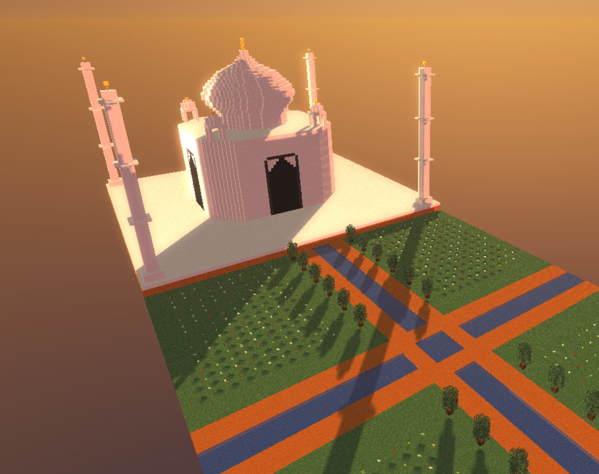
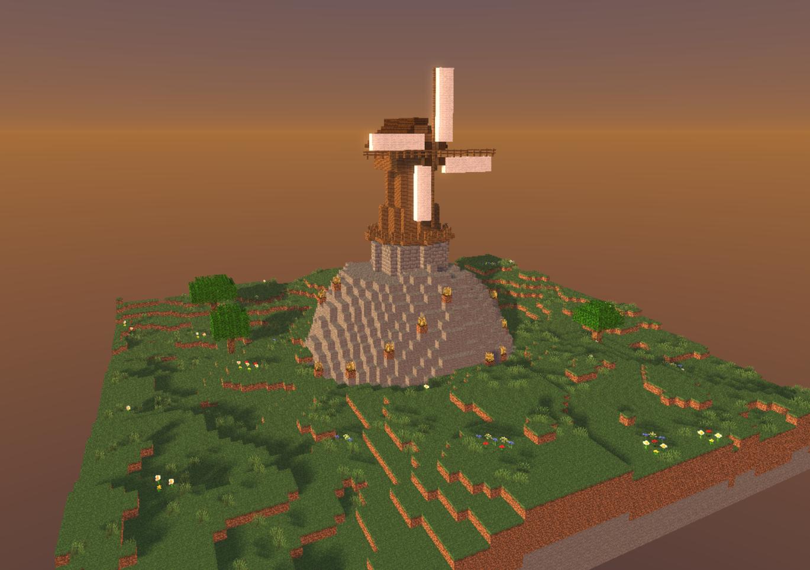
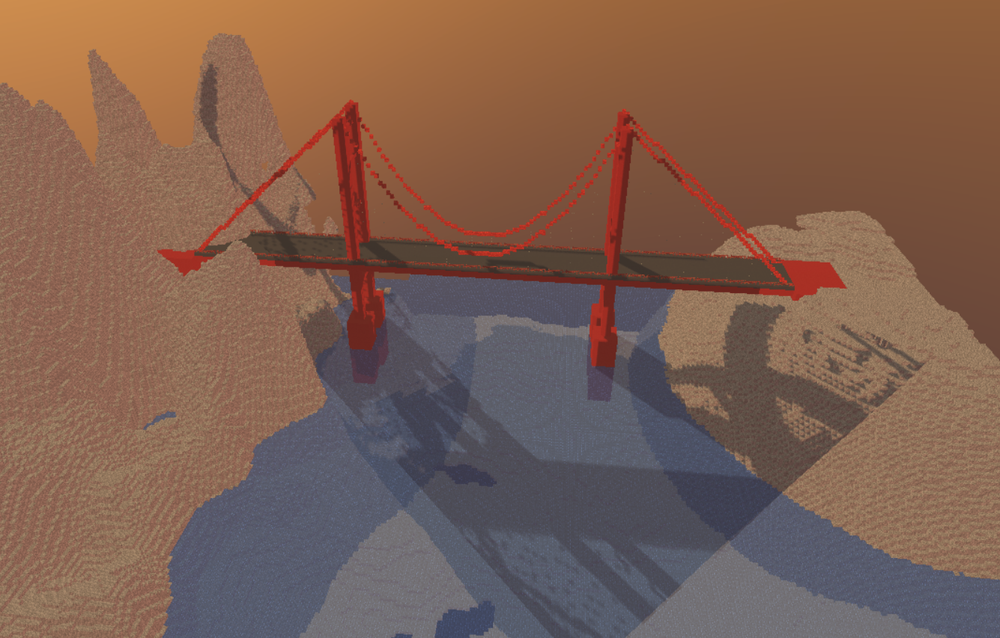

<div align="center">

# MinecraftLM

</div>

<div align="center">
<h3>Build 3D Worlds from Text — No Code Required</h3>

Project Team: [Matt Zhou](https://x.com/Mattzh1314), [Johnathan Chiu](https://x.com/johnathanchewy), [Preston Bourne](https://x.com/prestonb0urne), [Avinash Jain](https://x.com/avinashj_)

[](LICENSE)
[](https://github.com/mattzh72/minecraft-schematic-gen)
[](https://discord.gg/UNfAA4bte2)
</div>


https://github.com/user-attachments/assets/cdeb2167-1383-44ba-887e-fa3545ea08cf


## Table of Contents

- [What is MinecraftLM?](#what-is-minecraftlm)
- [What You Can Build](#what-you-can-build)
- [Quick Start](#quick-start)
- [Configuration](#configuration)

## What is MinecraftLM?

MinecraftLM lets you create 3D structures in Minecraft just by describing them. Type "build me a medieval castle with towers" and watch as an AI agent writes code, validates it, and generates your structure in real-time. Keep the conversation going to add gardens, modify interiors, or place your castle on procedural terrain—the agent maintains context across turns and ensures everything connects spatially.

**No templates, no limits**—the AI writes procedural code to understand spatial relationships, materials, and architectural concepts, giving you the freedom to build anything you can imagine.

## What You Can Build

MinecraftLM can create a wide range of structures—from realistic landmarks to fantasy worlds to functional objects. Here are some examples:

<table>
  <tr>
    <td align="center">
      <br/>
      <sub><b>"Build me a 747 airplane"</b></sub>
    </td>
    <td align="center">
      <br/>
      <sub><b>"Build the Taj Mahal with gardens"</b></sub>
    </td>
  </tr>
  <tr>
    <td align="center">
      <br/>
      <sub><b>"A windmill on a hill"</b></sub>
    </td>
    <td align="center">
      <br/>
      <sub><b>"The Golden Gate Bridge"</b></sub>
    </td>
  </tr>
</table>

### Buildings & Architecture
Build anything from a cozy cottage to a Gothic cathedral. The agent understands architectural concepts like walls, roofs, windows, doors, and can create multi-story structures with furnished interiors.

<!-- TODO: Add screenshot of architectural structure with interior view -->

### Vehicles & Objects
Create vehicles with realistic proportions and details—aircraft with proper wing geometry, ships with deck structures, or cars with wheels and windows.

<!-- TODO: Add screenshot showcasing vehicle generation -->

### Terrain & Landscapes
Generate natural landscapes with mountains, valleys, rivers, and vegetation. Place structures on terrain and watch them integrate seamlessly with automatic foundation filling.

<!-- TODO: Add screenshot of procedurally generated terrain -->

### Creative & Abstract
The agent can interpret artistic concepts and build abstract sculptures, pixel art, or fantastical creations.

<!-- TODO: Add screenshot of creative/abstract build -->

## Quick Start

### Prerequisites

You'll need these installed on your machine:

- **Python 3.11+** — Download from [python.org/downloads](https://www.python.org/downloads/)
- **Node.js 18+** — Download from [nodejs.org](https://nodejs.org/)
- **uv** (Python package manager) — Install from [docs.astral.sh/uv](https://docs.astral.sh/uv/)
- **API Key** — Get one from [Anthropic](https://console.anthropic.com), [OpenAI](https://platform.openai.com), or [Google](https://aistudio.google.com)

### Installation

**1. Clone the repository**
```bash
git clone https://github.com/mattzh72/minecraft-schematic-gen
cd minecraft-schematic-gen
```

**2. Install backend dependencies**
```bash
cd backend
uv sync
cd ..
```

**3. Install frontend dependencies** (this also builds the 3D renderer)
```bash
cd frontend
npm install
cd ..
```

**4. Configure your API key**
```bash
cp backend/.env.example backend/.env
```

Edit `backend/.env` and add your API key (see [Configuration](#configuration) below for details).

**5. Launch the application**
```bash
./run.sh
```

This starts both the backend server (port 8000) and frontend (port 5173) with hot reload enabled.

**6. Open your browser**

Navigate to [localhost:5173](http://localhost:5173) and start building!

<!-- TODO: Add screenshot of the initial app interface -->

### Troubleshooting

- **Port already in use**: Stop other processes on ports 8000 or 5173, or edit `run.sh` to use different ports
- **uv not found**: Make sure you've installed uv and it's in your PATH
- **npm install fails**: Try deleting `frontend/node_modules` and running `npm install` again
- **Backend fails to start**: Check that your API key is correctly configured in `backend/.env`

## Configuration

MinecraftLM supports multiple AI providers. You only need **one** API key to get started.

### Getting an API Key

Choose any provider and get an API key:

| Provider | Where to Get Key | Environment Variable |
|----------|-----------------|---------------------|
| **Anthropic** (Claude) | [console.anthropic.com](https://console.anthropic.com) | `ANTHROPIC_API_KEY` |
| **OpenAI** (GPT) | [platform.openai.com](https://platform.openai.com) | `OPENAI_API_KEY` |
| **Google** (Gemini) | [aistudio.google.com](https://aistudio.google.com) | `GEMINI_API_KEY` |

### Setting Up Your API Key

1. Copy the example environment file:
   ```bash
   cp backend/.env.example backend/.env
   ```

2. Open `backend/.env` in a text editor and add your API key:
   ```bash
   # Add only one of these:
   ANTHROPIC_API_KEY=sk-ant-your-key-here
   # OPENAI_API_KEY=sk-your-key-here
   # GEMINI_API_KEY=your-key-here
   ```

3. Save the file and restart the application if it's already running.

### Supported Models

The app will automatically detect which providers you've configured and show only those models in the selector:

| Provider | Available Models |
|----------|-----------------|
| **Anthropic** | Claude Sonnet 4.5, Claude Opus 4.5 |
| **OpenAI** | GPT-4.1, GPT-5 |
| **Google** | Gemini 3 Pro |

**Note**: Different models have different strengths. Claude models tend to be good at detailed architectural work, while GPT models may excel at creative interpretations. Experiment to find what works best for your use case.

---

Made with 💜 in San Francisco and New York City
